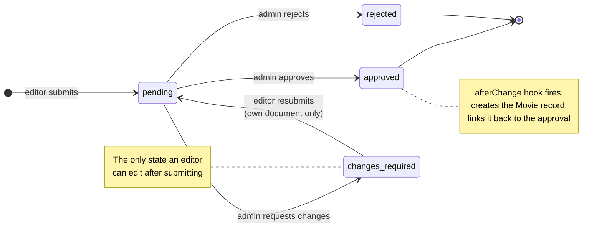

<div align="center">

# 🎬 Movie Approval CMS

**An editorial approval workflow where publishing is a consequence, not a button.**

Editors submit. Admins approve, reject, or send it back. Only on approval does a published
record come into existence — created by a hook, never by hand.

<p>
  
  
  
  
  
</p>

[The workflow](#-the-workflow) · [Access control](#-access-control) · [Setup](#-getting-started)

</div>

---

## The idea

Most CMS "approval" features are a status dropdown and a convention that nobody edits the
published record directly. Conventions leak. This one makes the rule structural:

**The `movies` collection has no submit form.** Nothing writes to it except an `afterChange` hook
that fires when an approval transitions to `approved`. An editor cannot publish by mistake,
because there is no path from an editor to a published record that doesn't pass through an admin.

The approval document keeps a permanent link to the movie it produced, so every published title
traces back to who submitted it and who approved it.

## 🔄 The workflow



`approved` and `rejected` are **terminal**. Access rules block updates to a document in either
state — including by admins — so the audit trail can't be rewritten after the decision.

## 🔐 Access control

Enforced in `access` on the collection, not in the UI, so it holds for the REST and GraphQL APIs
just as it does in the admin panel.

| Action | Admin | Editor | Anonymous |
|---|:---:|:---:|:---:|
| Read approvals | ✅ | ✅ | ❌ |
| Create approval | ✅ | ✅ — forced to `pending` | ❌ |
| Update `pending` | ✅ | ❌ | ❌ |
| Update `changes_required` | ✅ | ✅ — own submissions only | ❌ |
| Update `approved` / `rejected` | ❌ *terminal* | ❌ | ❌ |
| Delete approval | ✅ | ❌ | ❌ |

Two details worth calling out, both in `beforeChange`:

- **An editor cannot self-approve.** On create, status is forced to `pending` regardless of what
  the client sends. The field isn't trusted just because it's in the payload.
- **Resubmission is automatic.** When an editor edits their own `changes_required` document, the
  status flips back to `pending` without them touching the dropdown — so a fix can't sit
  invisibly in a state nobody is reviewing.

## 📦 Collections

| Collection | Purpose | Notable fields |
|---|---|---|
| **`movie-approvals`** | The workflow document | `title`, `description`, `releaseDate`, `status`, `comment`, `submittedBy`, `movie` (hidden link to the published record) |
| **`movies`** | Published titles | `title`, `description`, `releaseDate` — written only by the approval hook |
| **`users`** | Auth + roles | `role`: `admin` \| `editor` |

Approval fields are split across two tabs in the admin UI — **Movie Details** for the content,
**Approval** for status and reviewer comment — so reviewing feels like reviewing, not like editing.

## 🛠 Tech stack

| Layer | Choice |
|---|---|
| CMS & admin | Payload CMS 3 |
| App framework | Next.js (App Router) — admin, REST and GraphQL all mounted in one app |
| Database | MongoDB via `@payloadcms/db-mongodb` |
| Rich text | Lexical |
| Types | `payload-types.ts`, generated from the collection configs |
| Testing | Vitest (integration) + Playwright (e2e) |

## 🚀 Getting started

**Prerequisites** — Node 20+, and MongoDB running locally or on Atlas.

```bash
git clone https://github.com/prakashshuklahub/movie-approval-cms.git
cd movie-approval-cms
npm install
cp .env.example .env
npm run dev
```

Open **`http://localhost:3000/admin`** — the first visit prompts you to create the initial admin user.

<details>
<summary><b>Environment variables</b></summary>

<br/>

| Variable | Purpose |
|---|---|
| `DATABASE_URL` *(or `MONGODB_URL`)* | MongoDB connection string |
| `PAYLOAD_SECRET` | Long random secret used to sign tokens |

Running MongoDB locally on macOS:

```bash
brew services start mongodb-community
```

</details>

<details>
<summary><b>Trying the workflow end to end</b></summary>

<br/>

1. Create a second user with role **Editor**.
2. As the editor, create a movie approval — note it lands in `pending` even if you try to set otherwise.
3. As the admin, set it to **Changes Required** and leave a comment.
4. As the editor, edit the document — it returns to `pending` on its own.
5. As the admin, **Approve** it.
6. Open the **Movies** collection: the record is there, created by the hook.
7. Try editing the approval again — it's locked.

</details>

<details>
<summary><b>APIs and codegen</b></summary>

<br/>

Payload exposes both APIs automatically from the same collection configs:

| Endpoint | What |
|---|---|
| `/api/[...slug]` | REST |
| `/api/graphql` | GraphQL |
| `/api/graphql-playground` | Interactive GraphQL explorer |

After changing any collection or global, regenerate:

```bash
npm run generate:types      # refresh payload-types.ts
npm run generate:importmap  # refresh the admin import map
```

</details>

## 📦 Scripts

| Command | Description |
|---|---|
| `npm run dev` | Development server |
| `npm run devsafe` | Dev server with a cleared `.next` cache |
| `npm run build` | Production build |
| `npm start` | Production server |
| `npm run generate:types` | Regenerate `payload-types.ts` |
| `npm run generate:importmap` | Regenerate the admin import map |
| `npm run test:int` | Integration tests |
| `npm run test:e2e` | Playwright end-to-end tests |
| `npm run lint` | ESLint |

---

<div align="center">

Built by **[Prakash Shukla](https://github.com/prakashshuklahub)**

[The Hustling Engineer](https://www.youtube.com/@TheHustlingEngineer) · [LinkedIn](https://www.linkedin.com/in/prakash-shukla/)

</div>
